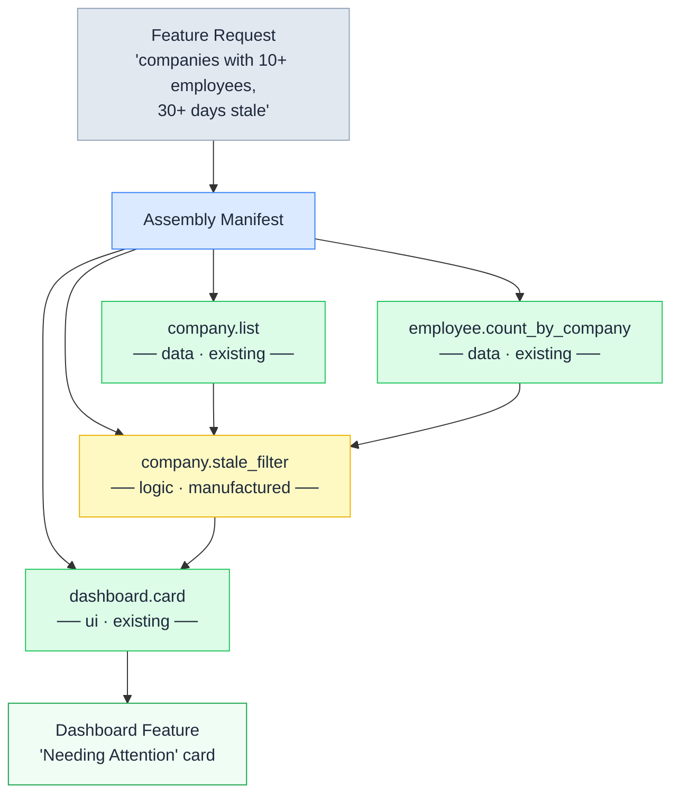
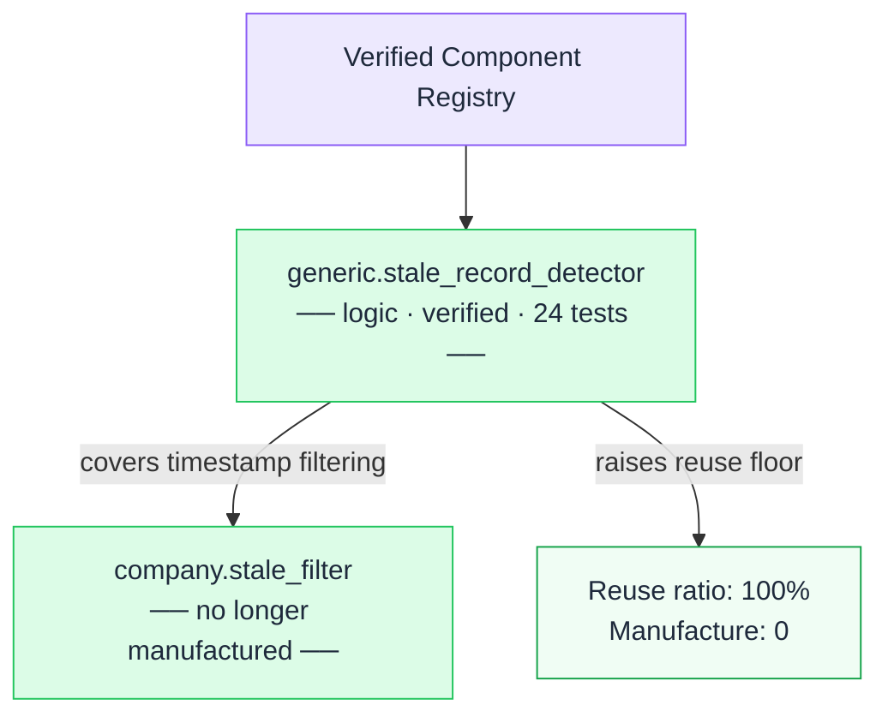

# Component Assembly Graph — Stale Company Dashboard Card

**Green** — reused from local catalog  
**Yellow** — manufactured component (net-new)  
**Blue** — Assembly Manifest (decision record)

---

## Registry-enhanced path

With the Verified Component Registry, manufacturing drops to zero:

**Purple** — Verified Component Registry source  
**Green** — components resolved as reuse (no manufacturing needed)

---

## Reuse ratio summary

| Path | Reuse | Manufacture | Ratio |
|---|---|---|---|
| Local catalog only | 3 | 1 | 75% |
| With Verified Component Registry | 4 | 0 | **100%** |
